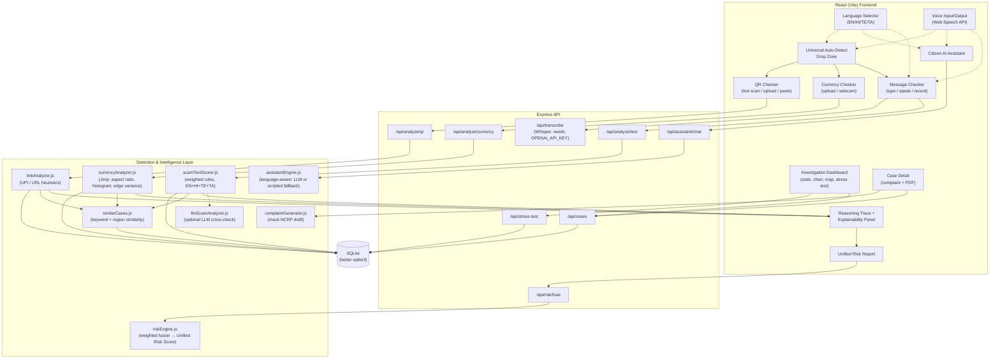

# SuRakshaAI — Your Shield Against Digital Fraud

A unified, explainable AI platform that detects scam messages, counterfeit currency, and
malicious payment QR codes/links — live, via camera or paste — fuses them into one fraud
risk score, and gives citizens and investigators a transparent, actionable view of the
threat, including a live scalability demo and one-tap mock complaint filing.

Built as a hackathon prototype. Fully local, runs with one `npm run dev`.

## What makes this different from a typical fraud-detection demo

These are the six unique differentiators — call these out explicitly to judges:

1. **Universal Auto-Detect Drop Zone** — one entry point on the home page. Drop an image or
   paste text/a link (or just speak) and the app figures out on its own whether it's a
   currency note, a QR code, or scam text, then routes it to the right analyzer with the
   analysis already running.
2. **Reasoning Trace animation** — every verdict plays a step-by-step "the AI is thinking"
   animation showing each signal being checked before the final score is revealed. This is
   the visual proof behind the explainability claim, not just a spinner.
3. **Multilingual Voice Agent** — citizens can speak in English, Hindi, Telugu, or Tamil
   (live mic or an uploaded call recording), get the message correctly analyzed for scam
   patterns in that language, and have the verdict read back out loud. Built for the citizen
   who's more comfortable talking than typing/reading English. See the dedicated section below.
4. **Similar Cases Matcher** — every result is checked against a keyword + region similarity
   index over real case data, surfacing "this matches N other reports nearby."
5. **Live Stress Test simulator** — a dashboard button injects ~500 synthetic cases in one
   burst and the stat cards, trend chart, and map update live, demonstrating the data model
   scales without any UI rework.
6. **One-tap mock Cybercrime Complaint generator** — auto-drafts an NCRP-style complaint from
   any flagged case, ready to copy. Clearly local/mock only — it never calls a real government
   endpoint.

## Multilingual Voice Agent

Built so a citizen who's more comfortable speaking than typing - or reading English - can
still get a correct, explained answer. Available from the home Drop Zone, the Message
Checker, and the Citizen Assistant.

- **Language selector** (navbar, top-right): English / हिन्दी / తెలుగు / தமிழ். Persists across
  the whole app for voice input, voice output, and UI text on the flagship screens.
- **Speak instead of type** — every mic button uses the browser's free, built-in Web Speech
  API set to the selected language (`en-IN` / `hi-IN` / `te-IN` / `ta-IN`), so speech-to-text
  works fully offline of any key. Accuracy depends on the browser/OS speech engine (best in
  Chrome).
- **Record or drop a voice recording** — the Message Checker's "Speak / Record" tab supports
  (a) live continuous speech-to-text you can watch build in real time, or (b) dropping an
  existing audio file (e.g. a saved scam call) for server-side transcription via OpenAI
  Whisper. The upload path only works if `OPENAI_API_KEY` is set on the server - without it,
  the UI shows a clear message and points to the free live-record option instead of crashing.
- **Correct analysis in any of the four languages** — `scamTextScorer.js` carries curated
  Hindi/Telugu/Tamil keyword patterns (native script + common transliteration) alongside the
  English rules, so common scam phrasing ("तुरंत", "వెంటనే", "உடனடியாக", OTP/Aadhaar/PIN
  requests, prize bait, bank/KYC impersonation, etc.) is flagged **without needing any API
  key**. When a non-English message scores low on the heuristic, or whenever the text is
  detected as non-English, the app additionally tries an optional LLM cross-check
  (`llmScamAnalyzer.js`) if `ANTHROPIC_API_KEY`/`OPENAI_API_KEY` is set - this can translate
  and reason about phrasing the curated keyword list doesn't cover, and its score/flags are
  merged into the same result. If no key is set, the app is honest about this: you get the
  curated-keyword heuristic result only.
- **Read the result aloud** — a "Listen" button on results and every assistant reply uses the
  browser's speechSynthesis to read back a localized verdict summary ("This looks high risk.
  Risk score: 90 out of 100." / translated equivalent), so a low-literacy user never has to
  read English text to understand the outcome.
- **Citizen Assistant replies in-language** — with an LLM key configured, the assistant is
  told to always reply in the selected language (it can read/write all four natively). Without
  a key, the scripted fallback has full translated canned responses per language for the
  common intents (QR safety, currency checks, OTP warnings, reporting guidance, and a
  heuristic scam read-out).

**Honest limitation:** the Reasoning Trace / Explainability panel step labels themselves stay
in English regardless of selected language (translating every dynamic rule-step sentence into
three more languages was out of scope for this pass) - the localization covers the
higher-traffic surfaces (drop zone, verdict, assistant, read-aloud) rather than every string
in the app.

## Important framing: what the "AI" actually is

Every detector in this project (scam text, currency image, QR/link) is a **transparent,
weighted, rules-based heuristic engine** — not a trained deep-learning model. This is a
deliberate choice, not a limitation: it means every verdict comes with a fully auditable
reasoning trace ("urgency language found", "aspect ratio out of range", "shortened URL
detected"), which is a much stronger fit for the Explainable AI judging criterion than a
black-box classifier would be. The README and code comments say this plainly everywhere it
matters — see `server/lib/scamTextScorer.js`, `server/lib/currencyAnalyzer.js`, and
`server/lib/linkAnalyzer.js` for the actual rules.

## What's real vs. mocked/simulated

| Feature | Status |
|---|---|
| Scam text, currency, QR/link heuristic scoring | Real, runs live against your input |
| Reasoning Trace, Explainability panel, Risk Gauge | Real, driven by actual analyzer output |
| Similar Cases Matcher | Real keyword/Jaccard + region similarity over live DB data |
| Fraud Risk fusion (Unified Risk Score) | Real weighted-average computation |
| Citizen Assistant LLM replies | Real if `ANTHROPIC_API_KEY` or `OPENAI_API_KEY` is set; otherwise a scripted decision-tree fallback (never crashes without a key) |
| Case location (region/lat/lng) | Simulated — a stable per-session "approximate location" from a fixed list of Bengaluru localities, not real geolocation |
| Stress Test data | Explicitly synthetic, labeled `[Simulated]` in the case table |
| Cybercrime complaint draft | Local mock only — **never submitted to any real government portal** |
| Dashboard password gate | Demo-only client-side gate (`police123`), not real auth |
| Currency/counterfeit detection | Heuristic image features (aspect ratio, color histogram, edge-sharpness variance) — not real banknote forensics |
| Voice input (mic → text) | Real, via the browser's built-in Web Speech API in English/Hindi/Telugu/Tamil — no key needed |
| Read-aloud (text → voice) | Real, via the browser's built-in speechSynthesis, localized per selected language |
| Multilingual heuristic scam detection | Real — curated Hindi/Telugu/Tamil keyword rules run with no API key |
| LLM-boosted multilingual translation/analysis | Real if `ANTHROPIC_API_KEY`/`OPENAI_API_KEY` is set; otherwise silently skipped (heuristic-only result stands) |
| Audio file upload transcription | Real only if `OPENAI_API_KEY` is set (uses Whisper); otherwise a clear in-UI message points to the free live-record option instead |

Nice-to-haves implemented: **CSV export**, **multilingual voice input/output** (English,
Hindi, Telugu, Tamil), **voice recording drop zone** for scam-call analysis.
Nice-to-haves *not* implemented (time-boxed out, core scope prioritized): dark/light mode
toggle, geospatial heatmap overlay (the map uses color-coded markers instead).

## Architecture



**Flow in one sentence:** the frontend feeds raw input (text, image, decoded QR/link) to one
of three detector modules, each of which returns a scored, step-by-step reasoning trace that
is rendered live, persisted to SQLite, matched against similar cases, and optionally fused
into a session-wide Unified Risk Score — while the dashboard and assistant read from the same
SQLite store to power investigation and citizen-facing conversation.

## Tech stack

- **Frontend:** React 19 + Vite, Tailwind CSS v4, hand-rolled shadcn-style components (Radix
  primitives for Accordion/Tabs), Recharts, Lucide icons, Framer Motion
- **Backend:** Node.js + Express (single server; serves the built frontend in production)
- **Database:** SQLite via `better-sqlite3`
- **Image analysis:** `jimp` (aspect ratio, color histogram, edge-sharpness variance)
- **QR decoding:** `jsQR`, client-side, from webcam frames or uploaded images
- **PDF generation:** `jspdf`
- **Maps:** Leaflet + OpenStreetMap tiles (no API key)
- **Citizen Assistant LLM:** `ANTHROPIC_API_KEY` or `OPENAI_API_KEY` if present in the
  environment, otherwise a scripted decision-tree fallback — the server never crashes if
  neither key is set
- **Voice input/output:** browser-native Web Speech API (`SpeechRecognition` for mic → text,
  `speechSynthesis` for text → voice) in English/Hindi/Telugu/Tamil — no key, no external
  service
- **Audio recording transcription:** OpenAI Whisper (`OPENAI_API_KEY`) for uploaded voice
  recordings; live speech uses the free Web Speech API path instead and needs no key

## Project structure

```
suraksha-ai/
├── server/                  Express API + SQLite
│   ├── db/                  schema.sql, db.js, seed.js (~25 realistic seed cases)
│   ├── lib/                 scorers, risk engine, matcher, complaint gen, llmScamAnalyzer.js
│   ├── routes/               analyze.js, cases.js, assistant.js, risk.js, stress.js, transcribe.js
│   └── index.js
├── client/                  React (Vite) frontend
│   └── src/
│       ├── components/      VerdictBadge, RiskGauge, ReasoningTrace, ExplainabilityPanel,
│       │                    AutoDetectDropZone, IncidentMap, TrendChart, CaseTable,
│       │                    LanguageSelector, VoiceInputButton, VoiceRecordingPanel,
│       │                    ReadAloudButton, ...
│       ├── pages/            Home, MessageChecker, CurrencyChecker, QrChecker,
│       │                    UnifiedReport, Assistant, Dashboard, CaseDetail
│       └── lib/               api.js, pdfReport.js, eli5.js, qrDecode.js, i18n.js,
│                              languageStore.js, speak.js, similarity helpers
├── PRESENTATION_OUTLINE.md
├── DEMO_SCRIPT.md
└── README.md
```

## How to run

Requires Node.js 20+.

```bash
# from the repo root
npm run install:all   # installs root, server, and client dependencies
npm run dev           # runs Express (port 5050) + Vite (port 5173/5174) together
```

Open the printed Vite URL (typically `http://localhost:5173`). The SQLite database is
created and seeded automatically on first server start — no manual setup needed.

Optional: to enable real LLM replies in the Citizen Assistant, set an environment variable
before starting the server:

```bash
export ANTHROPIC_API_KEY=sk-ant-...     # or
export OPENAI_API_KEY=sk-...
```

Without either key, the Assistant automatically uses its scripted decision-tree fallback, and
the multilingual heuristic scorer runs on its own (no LLM cross-check) — both are expected
behavior, not an error state.

Separately, uploading an existing voice recording for transcription (Message Checker →
"Speak / Record" → drop an audio file) specifically needs `OPENAI_API_KEY` (it calls OpenAI's
Whisper model). Live mic recording needs no key at all - it uses the browser's built-in
speech recognition instead.

**Dashboard demo password:** `police123` (shown directly on the login screen — this is a
demo-only client-side gate, not real authentication).

### Production build

```bash
npm run build   # builds the client into client/dist
npm start       # Express serves the API and the built frontend on one port
```

## Fallback notes (what changed from the original plan)

- **shadcn/ui** was not installed via its interactive CLI (it requires prompts incompatible
  with a scripted build). Instead, the same visual language was hand-built with Tailwind +
  Radix primitives (`@radix-ui/react-accordion`, `-tabs`) — functionally equivalent,
  same accessibility primitives shadcn itself wraps.
- **Tailwind CSS v4** was used instead of v3 (v3 is not the default `npm install` target
  anymore); configuration lives in `client/src/index.css` via `@theme` instead of a
  `tailwind.config.js` file.
- **Port 5000** conflicts with macOS AirPlay Receiver/ControlCenter on most Macs, so the
  Express server defaults to **port 5050** instead (override with `PORT=...`).
- **multer** was pinned to v2.x instead of the commonly-referenced v1.x line, since v1 has
  known unpatched vulnerabilities flagged by npm.
- Real device geolocation is **not** requested from the browser (avoids an extra permission
  prompt during a live demo); case locations use a simulated, session-stable "approximate
  location" from a fixed list of Bengaluru localities instead, clearly documented above.
